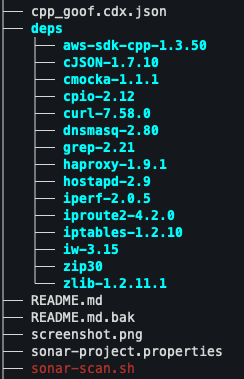
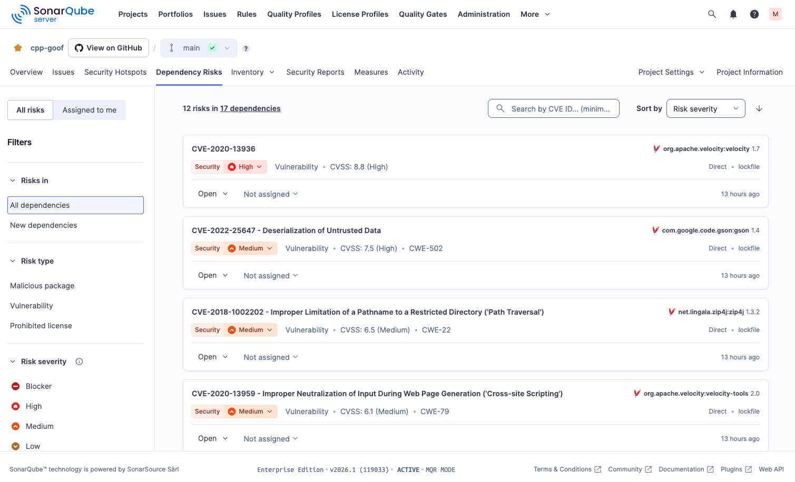

# SonarQube: SCA Scanning of Unmanaged Dependencies in C/C++ Projects with Syft and SBOM Import

Sonar currently does not support SCA for unmanaged dependencies in C/C++ projects. However, you can generate a Software Bill of Materials (SBOM) using tools like Syft and then analyze it with SonarQube.

This demo repo shows how to generate an SBOM for a C++ project using Syft, and then scan it with SonarQube to identify vulnerabilities.

Take note of the unmanaged dependencies in folder `deps` as an example:



## Installation & Usage

Install Syft to generate the SBOM:

```
brew install syft
syft dir:. -o cyclonedx-json --file cpp_goof.cdx.json --catalogers all
```

Example is using brew on macOS, but you can find installation instructions for other platforms in the [Syft Documentation](https://github.com/anchore/syft).

Then adjust the `sonar-project.properties` file to include the generated SBOM:

```
sonar.exclusions=**/*
sonar.sca.sbomImportPaths=cpp_goof.cdx.json
sonar.inclusions=cpp_goof.cdx.json
```

Then scanning via `sonar-scanner`:

```
sonar-scanner \
  -Dsonar.projectKey=e-corp-demo_cpp-goof_f56168d1-a2e5-4d19-b432-4a8681a5301a \
  -Dsonar.sources=. \
  -Dsonar.host.url=${SONARQUBE_URL} \
  -Dsonar.token=${SONARQUBE_TOKEN} \
  -Dsonar.verbose=true
```
Afterwards, you can view the vulnerabilities detected in the SonarQube dashboard.



## Questions & Contact

Mathias Conradt, Security Solutions Engineer at Sonar
https://www.linkedin.com/in/mathiasconradt/
https://x.com/mathiasconradt